<div align="center">



*A package manager for AI agents — curate, install, version, and orchestrate.*

[](https://www.python.org/)
[](https://github.com/Menta1ik/my-AI-factory)
[](https://github.com/Menta1ik/my-AI-factory)
[](https://github.com/Menta1ik/my-AI-factory/stargazers)
[](https://github.com/Menta1ik/my-AI-factory/commits/main)
[](https://github.com/bmad-code-org/BMAD-METHOD)

[](https://claude.com/claude-code)
[](https://github.com/google-gemini/gemini-cli)
[](https://cursor.com/)
[](https://codeium.com/windsurf)
[](https://github.com/vudovn/antigravity-kit)

</div>

**My AI Factory** is a high-tech AI development ecosystem that transforms your project into an intelligent hub. It automatically deploys, links, and orchestrates world-class AI best practices and tools into a single, unified workspace.

The intelligent Python-based installer provides seamless integration across five environments: **Gemini CLI**, **Claude Code**, **Cursor**, **Windsurf**, and **Antigravity IDE**.

---

## 👤 About the Author

I'm a vibe-coding evangelist — a solo builder running multiple large projects simultaneously, using AI agents as my development team.

I believe the future of software creation is not about typing code line by line. It's about thinking in systems, orchestrating AI agents, and shipping products that matter — fast, intentionally, and without burning out.

This repository is the quintessence of everything I use. Every tool here has been battle-tested across real products: a legal platform for the Spanish jurisdiction, a talent competition system with AI judging, a veterinary assistant, and more. This isn't a curated list — it's a living toolkit, shaped by hundreds of hours of actual vibe-coding sessions.

---

## 🐱 The Cats of Kharkiv

I run a cat shelter in Kharkiv, Ukraine — a city that has been under constant bombardment since the full-scale Russian invasion began in 2022.

While sirens go off and windows shake, the cats still need to be fed. Wounds still need treatment. Kittens found in the rubble still need warmth. The shelter keeps running — because someone has to.

Every star, every fork, every donation from this project goes directly to the shelter. Not to cloud infrastructure. Not to marketing. To food, medicine, and the people who show up every day — war or no war.

If this toolkit saved you time, made your project better, or just gave you a useful idea — please consider paying it forward.

🌍 [meowroom.top](https://meowroom.top) — see the shelter, meet the cats  
💛 [Donate via PayPal](https://paypal.me/vudovn) — 100% goes to the animals

> "We write code to build the future. We rescue cats to keep our humanity."

---

## 🚀 Quick Start

Deploy the complete development environment with a single command from your project root:

```bash
git clone https://github.com/Menta1ik/my-AI-factory.git && python3 my-AI-factory/factory.py install
```

That's it. The installer asks you which pack you want (Software / Game Dev / Grandmaster), clones a dozen curated repos, wires them into a single `.agent/` workspace, and creates `CLAUDE.md` / `GEMINI.md` / `.antigravity.md` so any of those tools can use the result immediately.

If you want to bootstrap a brand-new project, run `init` first to seed `CONTEXT.md` and `TASKS.md` with starter content for your project type:

```bash
python3 my-AI-factory/factory.py init --type saas        # or mobile, game, marketing, content
python3 my-AI-factory/factory.py install
```

---

## 🛠 Integrated Repositories

We have selected and integrated the best tools for every stage of development:

### 🧩 Platform Core
*   **[BMAD-METHOD](https://github.com/bmad-code-org/BMAD-METHOD):** A fundamental Agile development methodology driven by AI. Provides roles for PM, Architect, Developer, and QA.
*   **[Antigravity Kit](https://github.com/vudovn/antigravity-kit):** Professional templates and structure for IDE-oriented development.
*   **[Awesome Agent Skills](https://github.com/VoltAgent/awesome-agent-skills):** A curated collection of ready-to-use skills for everyday tasks.
*   **[Agent Browser](https://github.com/vercel-labs/agent-browser):** A powerful tool for autonomous navigation and testing in real browsers.

### 🏭 "Software Dev" Pack
*   **[UI/UX Pro Max](https://github.com/nextlevelbuilder/ui-ux-pro-max-skill):** Professional interface and design system engineering.
*   **[Marketing Skills](https://github.com/coreyhaines31/marketingskills):** A library of marketing strategies, SEO, and copywriting.
*   **[Impeccable CSS](https://github.com/pbakaus/impeccable):** Frontend quality standards and auditing.
*   **[Superpowers](https://github.com/obra/superpowers):** Enhanced agent capabilities for executing complex multi-step tasks.
*   **[Graphify](https://github.com/safishamsi/graphify):** Visualization of your project's architecture and dependencies.
*   **[Frontend Design](https://github.com/anthropics/claude-code/tree/main/plugins/frontend-design) (Anthropic):** Production-grade UI design guidelines — pulled from a single subfolder of the `anthropics/claude-code` monorepo via the new `subpath:` field.

### 🎮 "Game Dev" Pack
*   **[BMAD Game Studio](https://github.com/bmad-code-org/bmad-module-game-dev-studio):** Specialized roles for game development: Game Designer, Level Designer, Art Director.
*   **[Claude Game Studios](https://github.com/Donchitos/Claude-Code-Game-Studios):** Workflows and processes for game studios.
*   **[Caveman Engine](https://github.com/JuliusBrussee/caveman):** Reference utilities and logic for game engines.

---

## 🌟 What Makes This a Real Package Manager

Unlike a shell script that copies files, the factory is a small package manager for AI agents. Here is what that gives you:

1.  **Declarative catalog (`catalog.yaml`).**
    All available skills live in `catalog.yaml`, not in code. Adding a new skill is one block of text — no Python edits, no pull requests against `factory.py`.
2.  **Reproducible installs (`factory.lock.json`).**
    Every `install` records the exact commit SHA of every repo into `factory.lock.json`. Commit that file alongside `CLAUDE.md`, and the next person who runs `install` gets bit-for-bit the same environment. `update` is the *only* command that bumps the lock.
3.  **Persistent user choices (`factory.config.json`).**
    Any skill you add or remove by hand is remembered. Switch machines, `git clone`, `install` — you get back exactly the same set of skills.
4.  **Smart recursive routing.**
    Scans every downloaded repo, whether it ships a `.agent/` folder or a flat layout, and routes `agents/`, `workflows/`, `tools/`, `rules/`, `skills/` into a single unified workspace.
5.  **Manifest merging (`AGENTS.md`).**
    Stitches every repo's `AGENTS.md` into one project-level manifest your orchestrator can read top-to-bottom.
6.  **Auto-generated orchestrator workflow.**
    Drops a ready-to-run `pipeline.md` that links Analyst → Architect → Developer → QA into a single autonomous feature loop.
7.  **Native Claude Code integration.**
    Symlinks every skill into `.agent/.claude/skills/` so Claude Code sees them as first-class tools without any extra config.
8.  **Unified skill catalog for Gemini CLI & Antigravity.**
    Generates `GEMINI.md` and `.antigravity.md` with the full installed-skill list, BMAD roles, and startup instructions, so any tool can pick up the same context.
9.  **Safe re-runs.**
    Root config files use `<!-- AI-FACTORY:BEGIN/END -->` markers. Anything you write *outside* those markers survives every `update`. Pre-marker files are backed up to `.agent-vendor/.backups/YYYY-MM-DD/` before being upgraded.
10. **Isolated Python deps.**
    Skills shipped as Python packages (e.g. `graphify`) install into `.agent-vendor/.venv/`, never into your system Python. No PEP 668 errors on macOS, no version clashes.

---

## 🏛 How It Works (the full picture)

The factory is built on the Unix philosophy: managed external assets are strictly separated from your local edits, and every state-bearing decision lives in a small, human-readable file you can commit to git.

### The four data files you should know about

| File | Lives in | Who edits it | What it does |
|---|---|---|---|
| `catalog.yaml` | `my-AI-factory/` | You (rarely) / community via PR | Lists every skill the factory *can* install — name, URL, install method, tags, description. The single source of truth for "what exists". |
| `factory.config.json` | Project root | The factory (`add` / `remove`) | Remembers *your* choices: which preset you picked, which extra skills you added, which managed ones you excluded. Commit this. |
| `factory.lock.json` | Project root | The factory (`install` / `update`) | Pins the exact commit SHA of every installed repo. Commit this — it's how your team reproduces your environment. |
| `.agent-vendor/.backups/YYYY-MM-DD/` | Project root (gitignored) | The factory | Holds the previous version of any managed file you modified, so an `update` never destroys local edits. |

### Managed Space vs User Space

*   **Managed Space (`agents/`, `workflows/`, `tools/`, `rules/`, `skills/` inside `.agent/`)**
    Controlled by `factory.py`. These folders are recreated and refreshed on every `install` / `update`. **Don't edit files in here directly.** If you do, the factory backs them up to `.agent-vendor/.backups/` before overwriting, so you don't lose work — but the right workflow is the next bullet.
*   **User Space (`.agent/custom/`)**
    Your personal layer. To customize a downloaded agent, copy it from `agents/` into `custom/` and edit there. The orchestrator and Claude Code bridge will **always** prefer the `custom/` copy over the managed one with the same name. This is how you keep your tweaks and still pull upstream improvements.
*   **Shared State (`.agent/.shared/`)**
    `CONTEXT.md` (project mission), `TASKS.md` (work queue), `DECISIONS.md` (decision log). These represent the live state of your project. Agents read them on startup and append to them as they work. The factory never overwrites them after first creation.
*   **Root config files (`CLAUDE.md` / `GEMINI.md` / `.antigravity.md` / `.agent/orchestrator.md`)**
    Each contains a managed block bracketed by `<!-- AI-FACTORY:BEGIN -->` and `<!-- AI-FACTORY:END -->`. The factory only rewrites what's *inside* those markers. Anything you add above or below them survives every `update`. The first time the factory sees a pre-marker file with your edits, it backs the old version up before adopting the marker scheme.
*   **Cursor rules (`.cursor/rules/<skill-id>.mdc`)**
    For every discovered skill, the factory writes a `.mdc` file with `description` + `alwaysApply: false` (Cursor's "Agent Requested" mode — the agent pulls the rule in when it's relevant). The body is the skill's source `SKILL.md`. One skill = one `.mdc`, mirroring the `.claude/skills/` layout, so the same skill works in Claude Code and Cursor without manual porting.

### The install lifecycle, step by step

When you run `install`:

1. **Catalog parsed.** `catalog.yaml` is loaded by a small built-in parser (no external YAML library — zero dependencies).
2. **Preset resolved.** Your chosen preset (`software` / `gamedev` / `full`) is expanded into a list of repos. If `factory.config.json` exists, its `extras` and `excluded` are layered on top.
3. **Repos cloned.** Each repo is cloned into `.agent-vendor/<owner>/<repo>/`. If `factory.lock.json` exists, the exact SHAs from the lock are checked out — no surprises from upstream. Otherwise, HEAD is fetched and recorded into the lock.
4. **Assets routed.** Repo contents are smart-routed into the unified `.agent/` layout: `agents/` to `agents/`, `workflows/` to `workflows/`, etc. Standalone Markdown files become entries under `skills/`.
5. **Python packages installed.** Repos with `method: pip` (like `graphify`) are installed via `pip3 install -e`. If your system Python is locked down (PEP 668 / macOS), the factory transparently creates `.agent-vendor/.venv/` and installs there.
6. **Bridges built.** Every skill gets a symlink in `.agent/.claude/skills/<id>/SKILL.md` so Claude Code picks it up as a native tool.
7. **Manifests compiled.** `CLAUDE.md`, `GEMINI.md`, `.antigravity.md`, and `.agent/orchestrator.md` are regenerated (only the managed block is touched — your edits outside it are preserved). One `.mdc` per skill is also written into `.cursor/rules/` so Cursor picks up the same skill set.
8. **Lock saved.** `factory.lock.json` is written with each repo's resolved SHA and timestamp.

`update` does the same thing, except step 3 always pulls HEAD and step 8 *replaces* the lock. `integrate` skips git entirely and just rebuilds bridges and manifests — useful when you've added your own skill manually to `custom/`.

### Reproducibility in practice

The intended team workflow:

1. Lead developer runs `install`, gets a working `.agent/`, commits **`factory.lock.json`** and **`factory.config.json`** to the project repo.
2. Teammate clones the project, runs `python3 my-AI-factory/factory.py install`. The lock and config files make the result identical — same SHAs, same skill set, same custom overrides.
3. When the team wants to upgrade skills, *one* person runs `update`, reviews the new lock file in the diff, and commits it. Everyone else gets the upgrade on their next `install`.

---

## 🗂 Project Structure

```
my-project/
├── my-AI-factory/             ← The factory itself (installer + catalog)
│   ├── factory.py             ← All the package-manager logic
│   └── catalog.yaml           ← Declarative list of every available skill
│
├── factory.config.json        ← [COMMIT] Your preset + manual extras/excluded
├── factory.lock.json          ← [COMMIT] Exact SHAs — reproducibility
│
├── .agent/                    ← Project nervous system (commit this whole tree)
│   ├── AGENTS.md              ← Merged manifest of every installed agent
│   ├── orchestrator.md        ← Master map of all roles and skills
│   ├── custom/                ← [USER SPACE] Your edits — always win over managed/
│   ├── agents/                ← [MANAGED] Specialized AI personas (Frontend, QA, …)
│   ├── workflows/             ← [MANAGED] Step-by-step pipelines (pipeline.md)
│   ├── tools/                 ← [MANAGED] Executable scripts and MCP tools
│   ├── rules/                 ← [MANAGED] System-wide constraints
│   ├── skills/                ← [MANAGED] Library of all installed skills
│   ├── .claude/skills/        ← Symlinks so Claude Code sees skills as native
│   ├── .shared/               ← Shared memory (CONTEXT, TASKS, DECISIONS)
│   └── learned/               ← Self-learning knowledge base
│
├── .agent-vendor/             ← [GITIGNORED] Raw clones — never edit by hand
│   ├── <owner>/<repo>/        ← Cloned upstream repos (one per skill)
│   ├── .venv/                 ← Isolated Python env for pip-based skills
│   └── .backups/YYYY-MM-DD/   ← Auto-backups of any managed file you modified
│
├── CLAUDE.md                  ← Auto-generated config for Claude Code
├── GEMINI.md                  ← Auto-generated config for Gemini CLI
├── .antigravity.md            ← Auto-generated config for Antigravity IDE
└── .cursor/rules/             ← Auto-generated .mdc rules for Cursor (one per skill)
```

**What to commit:** `.agent/`, `factory.config.json`, `factory.lock.json`, the root `*.md` files, `.cursor/rules/`.
**What to gitignore:** `.agent-vendor/` (it's a 100+ MB cache — fully reproducible from the lock).

---

## 🛠 Command Reference

All commands are run from your project root as `python3 my-AI-factory/factory.py <command>`.

### Installation & updates

| Command | What it does | When to use |
|---|---|---|
| `install` | Bootstrap the factory: clone every repo, route assets, build bridges, write the lock. Respects an existing `factory.lock.json` to give bit-for-bit reproducibility. | First-time setup, or onboarding a teammate from a committed lock. |
| `install --package software\|gamedev\|full` | Same as above but skips the interactive prompt. | Scripting or CI. |
| `update` | Pulls HEAD of every enabled repo, rewrites `factory.lock.json` with the new SHAs. | When you actively want to upgrade. Review the lock diff before committing. |
| `integrate` | Rebuild symlinks and manifests without touching git or the lock. | After dropping a hand-written skill into `.agent/custom/`. |

### Browsing and managing the catalog

| Command | What it does |
|---|---|
| `list` | Show every skill in `catalog.yaml`, marking which are installed (●) vs available (○), with tags and descriptions. |
| `add <owner/repo>` | Enable a single skill on top of your preset. Clones it, updates `factory.config.json` and `factory.lock.json`, re-integrates. |
| `remove <owner/repo>` | Disable a skill. Removes the vendor clone, prunes the skill from `.agent/skills/`, updates config and lock. |

### Diagnostics

| Command | What it does |
|---|---|
| `status` | Show the current `factory.lock.json` — every installed repo with its short SHA, plus warnings for anything enabled but missing from the lock. No network access. |
| `doctor` | Health check: external tools (`git` / `npx` / `pip3`), missing clones, broken symlinks, custom overrides, vendor disk usage. The first thing to run when something feels off. |

### Project bootstrap

| Command | What it does |
|---|---|
| `init` | Seed `.agent/.shared/CONTEXT.md` and `TASKS.md` with starter content. Prompts for project type. |
| `init --type saas\|mobile\|game\|marketing\|content` | Non-interactive version. Each type ships its own mission statement, stack hints, and a starter task list. |

### A real workflow, end to end

```bash
# 1. Bootstrap a new SaaS project
mkdir my-saas && cd my-saas
git init
git clone https://github.com/Menta1ik/my-AI-factory.git
python3 my-AI-factory/factory.py init --type saas
python3 my-AI-factory/factory.py install --package software

# 2. Commit the reproducible state
echo ".agent-vendor/" >> .gitignore
git add .agent factory.lock.json factory.config.json CLAUDE.md GEMINI.md .antigravity.md
git commit -m "Bootstrap AI factory"

# 3. Add an extra skill you didn't get from the preset
python3 my-AI-factory/factory.py add JuliusBrussee/caveman
git add factory.config.json factory.lock.json .agent/
git commit -m "Add caveman engine skill"

# 4. Months later: upgrade everything
python3 my-AI-factory/factory.py update
python3 my-AI-factory/factory.py doctor   # sanity check
git add factory.lock.json .agent/
git commit -m "Upgrade AI skill packs"
```

---

## 🩺 Troubleshooting

| Symptom | What's likely happening | Fix |
|---|---|---|
| `npx not found in PATH` | Node.js isn't installed. | Install Node 18+. BMAD-METHOD won't install without it; everything else will still work. |
| `externally-managed-environment` during pip install | macOS / modern Linux blocks `pip install` into system Python (PEP 668). | The factory automatically falls back to `.agent-vendor/.venv/`. No action needed. |
| Broken symlinks after a manual git operation | Something moved files in `.agent/skills/` while `.agent/.claude/skills/` still pointed at the old path. | `python3 factory.py integrate` rebuilds every link. |
| Skill I added doesn't show up | The factory didn't re-run integrate after your edit. | `python3 factory.py integrate`, or `add <owner/repo>` if it's a catalog entry. |
| My custom edits to a managed file disappeared | They were preserved — look in `.agent-vendor/.backups/YYYY-MM-DD/`. | Move them into `.agent/custom/` instead so they survive future updates. |
| Teammate's environment doesn't match mine | They haven't run `install` against the committed `factory.lock.json` yet. | `git pull && python3 my-AI-factory/factory.py install`. |

When in doubt, run `python3 my-AI-factory/factory.py doctor` first — it surfaces most issues in one shot.

---

## 🧩 Adding Your Own Skill to the Catalog

To make a new skill installable for everyone, open `my-AI-factory/catalog.yaml` and append a block under `repos:`:

```yaml
  - name: yourname/your-skill-repo
    url: https://github.com/yourname/your-skill-repo.git
    method: copy        # copy | npx | pip
    tags: [software, your-domain]
    description: One-line summary shown in `factory.py list`
```

Then run `python3 factory.py install` (or `add yourname/your-skill-repo`) and it gets picked up like any other skill. Send a PR to `catalog.yaml` to share it with the community — no code changes required.

### Installing a single skill from a monorepo

Some repos (like `anthropics/claude-code`) bundle many independent skills. Use the optional `subpath:` field to install just one folder instead of dragging in the whole repo:

```yaml
  - name: anthropics/claude-code
    url: https://github.com/anthropics/claude-code.git
    method: copy
    subpath: plugins/frontend-design/skills/frontend-design
    tags: [software, frontend, design]
    description: Anthropic frontend-design skill
```

When `subpath:` is set, the factory copies that folder verbatim into `.agent/skills/<folder-name>/` as a single skill. Smart-routing and the full-repo Markdown scan are skipped — you get exactly the skill folder and nothing else.

---

## 🤝 Contributing

Your "Factory" is built on Open Source principles. We encourage you to use and extend these tools to create better products.

*[my-AI-factory](https://github.com/Menta1ik/my-AI-factory)*
